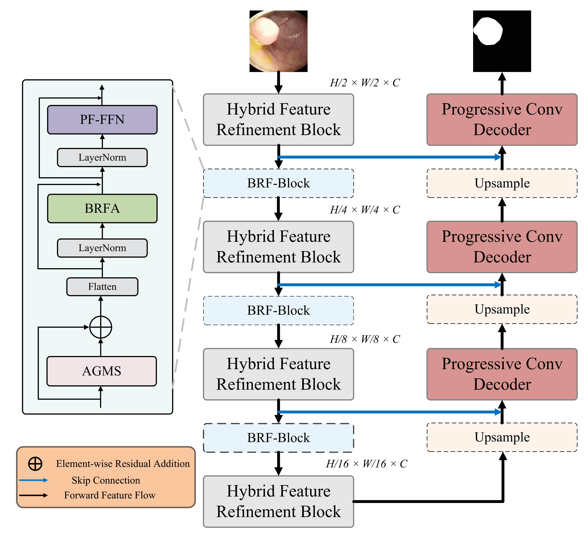
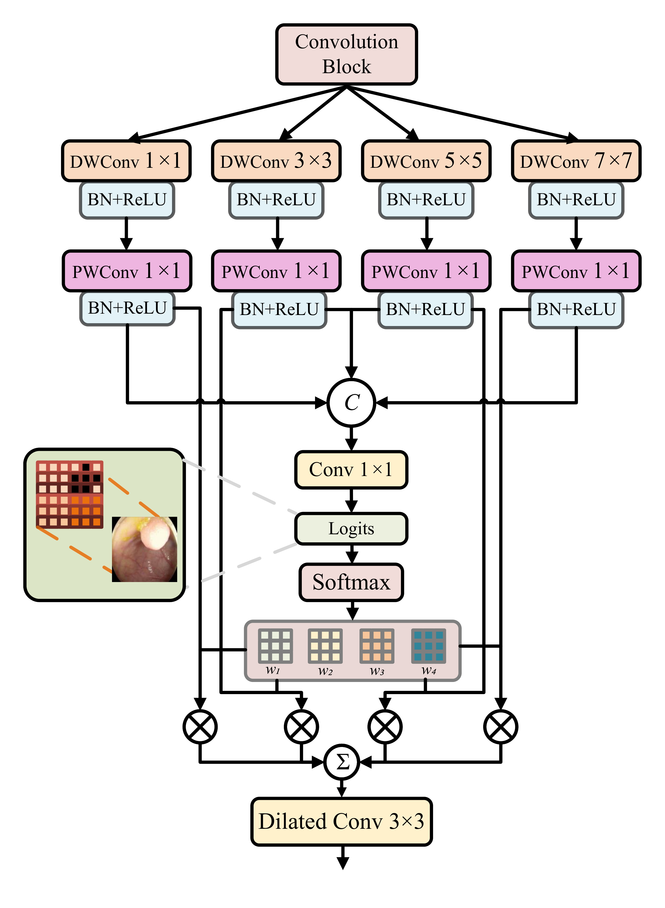
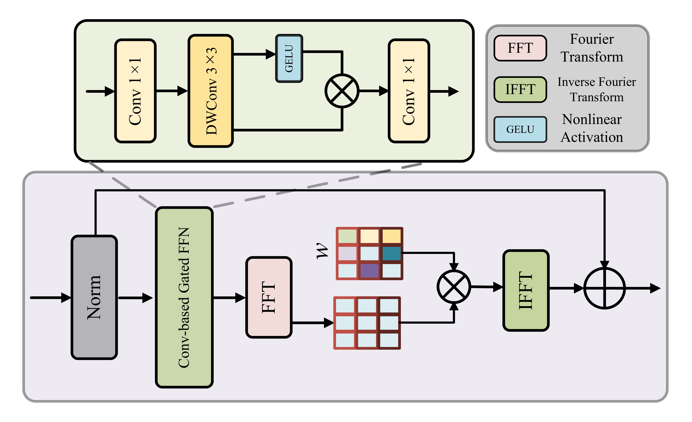

# BRF-Net for Medical Image Segmentation

> **Paper Title**  
> **BRF-Net: a Hybrid CNN-Transformer with Bidirectional Refinement and Spatial-Channel Fusion Attention for Medical Image Segmentation**

> **Status:** 🟢 Under Review

<p align="center">
  
  
  
  
</p>

---

## 📢 News

- [2026-03-XX] The anonymous review repository of **BRF-Net** is released.
- [2026-03-XX] Core code, training pipeline, and evaluation scripts are organized for reproducibility.

---

## 📖 Overview

This repository contains the anonymous implementation of **BRF-Net**, a hybrid CNN-Transformer framework for medical image segmentation.

Medical image segmentation remains challenging due to three common issues:  
(1) large anatomical and lesion-scale variation,  
(2) insufficient spatial-semantic interaction in ambiguous regions, and  
(3) loss of boundary-sensitive high-frequency details caused by the low-pass tendency of self-attention.

To address these challenges, **BRF-Net** introduces three dedicated modules:

- **Adaptive Gated Multi-Scale (AGMS)** for scale-adaptive shallow feature extraction;
- **BRF Attention Block** for bidirectional spatial-channel refinement;
- **Patch-wise Fourier Feed-Forward Network (PF-FFN)** for frequency-aware boundary preservation.

BRF-Net is extensively evaluated on multiple public benchmarks spanning **endoscopy, dermoscopy, ultrasound, microscopy, CT, and MRI**, showing strong quantitative and qualitative performance across diverse medical image segmentation tasks.

---

## 🌟 Key Contributions

- **Scale-adaptive shallow representation learning.**  
  We introduce **AGMS**, which dynamically aggregates multi-scale receptive fields through competitive gating, improving robustness to large variations in target size and morphology.

- **Bidirectional spatial-channel reasoning.**  
  We propose the **BRF Attention Block**, where spatial window attention and channel self-attention refine each other through reciprocal interaction, improving semantic consistency in ambiguous regions.

- **Frequency-aware boundary refinement.**  
  We develop **PF-FFN**, which incorporates learnable frequency-domain modulation into the Transformer feed-forward pathway to better preserve boundary-sensitive high-frequency information.

- **Strong cross-dataset generalization.**  
  BRF-Net is validated on **eight public datasets** across multiple imaging modalities and achieves consistently competitive or state-of-the-art performance.

---

## 🏗️ Framework Architecture

<p align="center">
  
</p>

<p align="center">
  <em>Overall architecture of BRF-Net. Replace <code>assets/BRF-Net.png</code> with your actual framework figure.</em>
</p>

BRF-Net follows a hierarchical hybrid encoder-decoder design.

- In the **shallow encoder stages**, **AGMS** enhances scale adaptivity by dynamically selecting effective receptive fields.
- In the **deep encoder stages**, the attention core is replaced by the **BRF Attention Block** to strengthen bidirectional spatial-semantic interaction.
- In the **Transformer feed-forward pathway**, **PF-FFN** preserves high-frequency structural details via spectral modulation.
- A symmetric decoder progressively restores resolution and fuses encoder features through skip connections.

---

## 🔍 Main Modules

### 1. AGMS Block

<p align="center">
  
</p>

<p align="center">
  <em>Architecture of the AGMS block.</em>
</p>

AGMS employs four parallel depthwise-separable branches with different kernel sizes to capture multi-scale responses.  
The branch outputs are reweighted by competitive Softmax gating and then fused to produce scale-adaptive shallow representations.

---

### 2. BRF Attention Block

<p align="center">
  
</p>

<p align="center">
  <em>Architecture of the BRF Attention Block.</em>
</p>

The BRF Attention Block splits attention heads into:

- a **spatial stream** for local structural modeling via **SWA**;
- a **channel stream** for global semantic reasoning via **CSA**.

The two streams are refined through reciprocal interaction and then fused by lightweight gating and convolutional operations.

---

### 3. PF-FFN

<p align="center">
  
</p>

<p align="center">
  <em>Architecture of the PF-FFN.</em>
</p>

PF-FFN first performs local nonlinear refinement through a convolution-based gated branch, and then applies FFT-based spectral modulation with a learnable frequency filter.  
This design helps recover high-frequency information that may be weakened by attention, especially around weak or blurry boundaries.

---

## 📊 Results and Visualization

### 1. Quantitative Comparison

<p align="center">
  
</p>

<p align="center">
  <em>Quantitative comparison of BRF-Net with representative CNN, Transformer, and hybrid methods.</em>
</p>

### 2. Qualitative Comparison

<p align="center">
  
</p>

<p align="center">
  <em>Qualitative comparison on representative datasets. Error regions can be highlighted for clearer visual analysis.</em>
</p>

### 3. Grad-CAM Visualization

<p align="center">
  
</p>

<p align="center">
  <em>Grad-CAM visualizations of different methods on representative datasets.</em>
</p>

---

## 📦 Dataset Preparation

We evaluate BRF-Net on **eight public datasets** covering multiple medical imaging modalities.

| Dataset | Modality | Task Type | Target |
|---|---|---|---|
| CVC-ClinicDB | Endoscopy | Binary | Polyp |
| ETIS-LaribPolypDB | Endoscopy | Binary | Polyp |
| Breast-Lesions-USG | Ultrasound | Binary | Breast lesion |
| ISIC2017 | Dermoscopy | Binary | Skin lesion |
| ISIC2018 | Dermoscopy | Binary | Skin lesion |
| DSB2018 | Microscopy | Binary | Nuclei |
| Synapse | CT | Multi-class | Abdominal organs |
| ACDC | MRI | Multi-class | Cardiac structures |

> [!NOTE]
> Synapse and ACDC follow predefined Train/Test protocols.  
> The remaining datasets use fixed train/validation/test splits under the same experimental setting.

---

## 📁 Recommended Directory Structure

```text
Project_Root/
├── assets/                    # README figures
├── configs/
│   └── default.yaml
├── datasets/
│   ├── CVC-ClinicDB/
│   │   ├── images/
│   │   └── masks/
│   ├── ETIS-LaribPolypDB/
│   ├── Breast-Lesions-USG/
│   ├── ISIC2017/
│   ├── ISIC2018/
│   ├── DSB2018/
│   ├── Synapse/
│   └── ACDC/
├── outputs/                   # saved predictions
├── runs/                      # logs / checkpoints
├── src/                       # source code
├── requirements.txt
├── train.py
├── test.py
└── README.md
```

---

## 🙏 Ackonwledge
*We gratefully acknowledge [Zongjian Yang](https://github.com/Saury997) for his valuable guidance and support.*

This repo is based in part on the works of A, B and C for their open-source code. We thank the authors for their valuable contributions, which inspired and guided our implementation.
